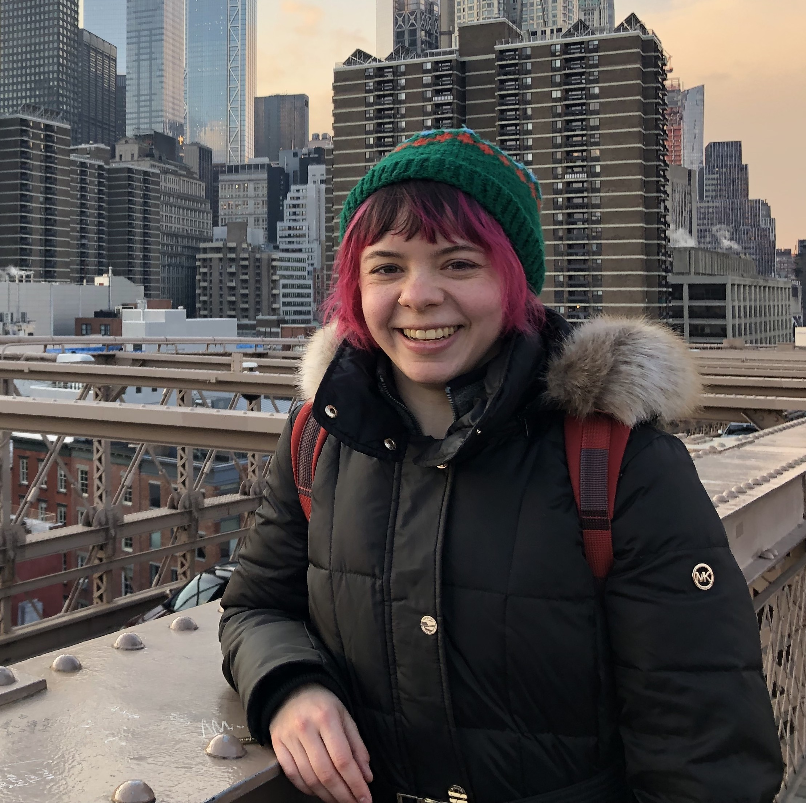
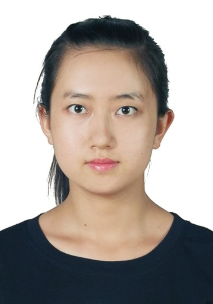
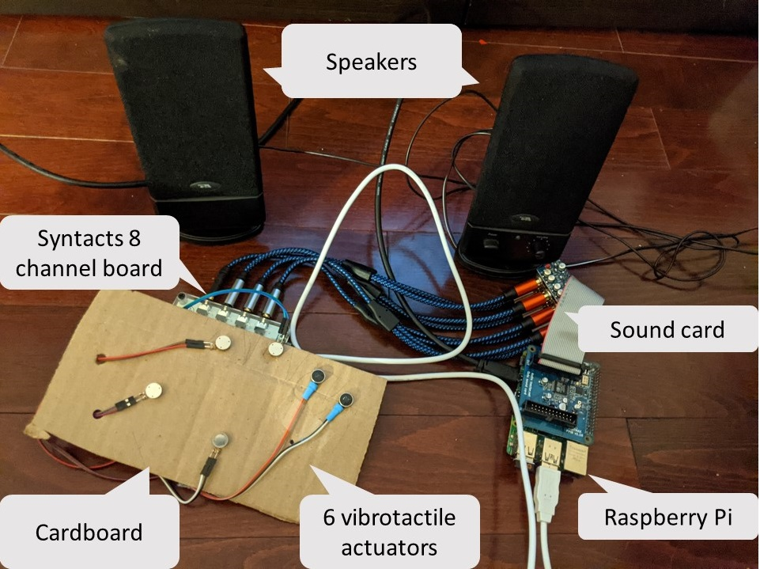
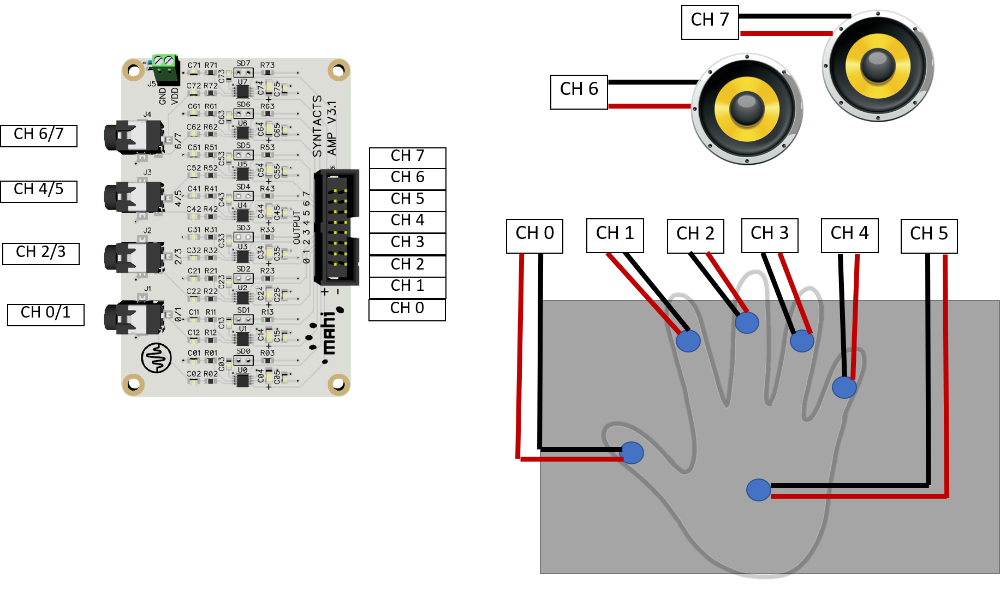

# WHC2021SIC Vibroraptile

<!-- Replace Project Template by your team name in title and description -->

Vibroraptile for the IEEE World Haptics Conference 2021 Student Innovation Challenge

https://2021.worldhaptics.org/sic/

## Authors

### Team

<!-- For each team member, duplicate this following subsection and update Name, biography, pronouns and website. Please store pictures under images/portraits/ and use only Name in CamelCase for filenames. -->

#### Sri Gannavarapu

Is currently a MSc student at the Shared Reality Lab, under the supervsion of Dr.Jeremy Cooperstock. Sri's research interests are in the feilds of multimodal haptic interactions and accessible technolgy. He recevied an B.Eng in Mechatronics Engineering.  <!-- insert biography -->

Affiliation: McGill University
 
Find more information on their <!-- update pronouns--> [website](https://).

#### Linnea Kirby

Linnea Kirby is a self-proclaimed "Contemporary Renaissance Person," with interests ranging from the creative to the analytical. She is currently an Electrical and Computer Engineering Masters student at McGill University in Jeremy Cooperstock's Shared Reality Lab. She received a B.A. in Psychology with a concentration in Cognitive Sciences and a minor in Computer Science from Oberlin College in 2016 and graduated from a year of the New England Center for Circus Arts (NECCA)’s PROTrack program in 2018, where she majored in contortion and unofficially minored in Chinese Pole. She is now constantly devising ways of integrating her passion for both technology and circus arts.

Throughout her work, Linnea has explored a range of topics, often imbued with dry wit, including perception of self and of the world, interaction between objects and space, and the bounds of femininity and androgyny.

Other talents include over nine years of classical training in ballet and piano, a conversational knowledge of French, the ability to shoot an Asiatic recurve bow (mostly accurately), and a mostly green thumb (she's currently learning about propagation, but her cats keep trying to steal the baby plants).

Affiliation: McGill University
 
Find more information on her [website](https://linneakirby.com/).

### Yaxuan Li

Yaxuan is a master's student in Electrical Engineering at McGill University, under the supervision of Dr. Jeremy Cooperstock at the Shared Reality Lab. Her research focus on developing haptics authoring algorithm. She has experience in haptics authoring, coding, and embedded system.

Affiliation: McGill University

<!-- ### Advisor -->

<!-- Uncomment this section title and add a #### Name subsection if your team appointed an advisor. -->

### Chairs

#### Christian Frisson

Christian Frisson is an associate researcher at the Input Devices and Music Interaction Laboratory (IDMIL) (2021), previously postdoctoral researcher at McGill University with the IDMIL (2019-2020), at the University of Calgary with the Interactions Lab (2017-2018) and at Inria in France with the Mjolnir team (2016-2017). He obtained his PhD at the University of Mons, numediart Institute, in Belgium (2015); his MSc in “Art, Science, Technology” from Institut National Polytechnique de Grenoble with the Association for the Creation and Research on Expression Tools (ACROE), in France (2006); his Masters in Electrical (Metrology) and Mechanical (Acoustics) Engineering from ENSIM in Le Mans, France (2005). 
Christian Frisson is a researcher in Human-Computer Interaction, with expertise in Information Visualization, Multimedia Information Retrieval, and Tangible/Haptic Interaction. Christian creates and evaluates user interfaces for manipulating multimedia data. Christian favors obtaining replicable, reusable and sustainable results through open-source software, open hardware and open datasets. 
With his co-authors, Christian obtained the IEEE VIS 2019 Infovis Best Paper award and was selected among 4 finalists for IEEE Haptics Symposium 2020 Most Promising WIP.

Find more information on his [website](https://frisson.re).

#### Jun Nishida

Jun Nishida is **Currently** Postdoctoral Fellow at University of Chicago & Research Fellow at Japan Society for the Promotion of Science (JSPS PDRA) / **Previously** JSPS Research Fellow (DC1), Project Researcher at Japanese Ministry of Internal Affairs and Communications, SCOPE Innovation Program & PhD Fellow at Microsoft Research Asia / Graduated from Empowerment Informatics Program, University of Tsukuba, Japan. 

I’m a postdoctoral fellow at University of Chicago. I have received my PhD in Human Informatics at University of Tsukuba, Japan in 2019. I am interested in designing experiences in which all people can maximize and share their physical and cognitive capabilities to support each other. I explore the possibility of this interaction in the field of rehabilitation, education, and design. To this end, I design wearable cybernic interfaces which share one’s embodied and social perspectives among people by means of electrical muscle stimulation, exoskeletons, virtual/augmented reality systems. Received more than 40 awards including Microsoft Research Asia Fellowship Award, national grants, and three University Presidential Awards. Review service at ACM SIGCHI, SIGGRAPH, UIST, TEI, IEEE VR, HRI.

Find more information on their [website](https://junis.sakura.ne.jp/wp).

#### Heather Culbertson

Heather Culbertson is a Gabilan Assistant Professor of Computer Science at the University of Southern California. Her research focuses on the design and control of haptic devices and rendering systems, human-robot interaction, and virtual reality. Particularly she is interested in creating haptic interactions that are natural and realistically mimic the touch sensations experienced during interactions with the physical world. Previously, she was a research scientist in the Department of Mechanical Engineering at Stanford University where she worked in the Collaborative Haptics and Robotics in Medicine (CHARM) Lab. She received her PhD in the Department of Mechanical Engineering and Applied Mechanics (MEAM) at the University of Pennsylvania in 2015 working in the Haptics Group, part of the General Robotics, Automation, Sensing and Perception (GRASP) Laboratory. She completed a Masters in MEAM at the University of Pennsylvania in 2013, and earned a BS degree in mechanical engineering at the University of Nevada, Reno in 2010. She is currently serving as the Vice-Chair for Information Dissemination for the IEEE Technical Committee on Haptics. Her awards include a citation for meritorious service as a reviewer for the IEEE Transactions on Haptics, Best Paper at UIST 2017, and the Best Hands-On Demonstration Award at IEEE World Haptics 2013.

Find more information on her [website](https://sites.usc.edu/culbertson/).

## Contents

Generated with `npm run toc`, see [INSTALL.md](INSTALL.md).

Once this documentation becomes very comprehensive, the main file can be split in multiple files and reference these files.

<!-- Table of contents generated by running from repository root: npm run toc -->

<!-- toc -->

- [Abstract](#abstract)
- [Introduction](#introduction)
  * [Documentation](#documentation)
    + [Hardware](#hardware)
      - [Sensors wiring](#sensors-wiring)
    + [Software](#software)
- [Acknowledgements](#acknowledgements)
- [License](#license)

<!-- tocstop -->

## Abstract
Vibroraptile is a vibrotactile display that maps auditory signals from a nature exhibit to give visitors the ability to not only see and hear, but also feel otherwise untouchable animals.
Touch is a crucial modality when designing a tool that is inclusive for all populations, including those with disabilities or impairments; furthermore, young visitors who cannot read and visitors who do not speak the language used in the exhibit are unable to gain insight from written information and so can benefit from the addition of haptics. We believe Vibroraptile would be a useful addition to natural history museums, zoos, aquariums, national parks, and animal sanctuaries. 
For our submission, we simulated a regional exhibit (northeastern North America) by showcasing a day in the life of a blue jay family. With the addition of curated haptics effects, visitors are able to "touch" the animals they hear in our audio soundscape, such as blue jays, mourning doves, chipmunks, woodpeckers, coyotes, and a hawk.

### Documentation

#### Hardware

<!-- Describe your hardware components -->
Required hardware:
- Syntacts 8 channel board
- 6 vibrotactile actuators
- Raspberry Pi
- Audio Injector Octo sound card
- Male-female Jumper Wires (as necessary) 
- cardboard

##### Assembling the tactile display
Additional tools and materials:
- scissors
- pencil
- glue (optional)
- hole punch (optional)
- tape (optional)

1) Using the scissors, cut out a rectangular cardboard piece roughly 20cm x 10cm.
2) Place one hand on the cardboard sheet and lightly trace your hand.
3) Position the actuators so that one actuator touches each finger and one makes contact with the palm. 
4) If the sticky backs of the actuators is not strong enough to secure them, use glue for extra support.
5) (Optional) To clean up the wiring, punch any holes you need and tape the wiring as you see fit.

##### Wiring
1) Using the diagram below as a guide, connect the actuators and speakers to the Syntacts board.

2) Connect the 4 aux cables from the Audio Injector Octo sound card to the Syntacts board.
3) Connet the power cable of the Syntacts board into one of the USB ports on the Raspberry Pi.
4) Finally, connect the Raspberry Pi to power.
<!-- Feel free to remove or adapt the following explanation once you have understood its potential implications for your project. -->

<!-- We use the SparkFun Qwiic system to rapidly and remotely prototype sensors without much soldering. Qwiic uses the I2C communication protocol with addresses assigned per board model.
Our Qwiic-based architectures may require:
- 1 Qwiic MUX I2C multiplexer board per group identical sensor/board model (example: needed by 2 flex finger boards in the figures below)
- 1 Qwiic ADC board per group of 4 sensors that are not implemented as Qwiic boards (example: needed by 4 FSRs sensors in the figures below)
-->
<!-- Adapt this sensor architecture, covering all possible sensors accross all teams, to your team. 

Made with [drawio-desktop](https://github.com/jgraph/drawio-desktop/) (online version: [diagrams.net](https://www.diagrams.net/)).-->

<!-- see: https://www.diagrams.net/blog/embed-diagrams-github-markdown -->

#### Software

<!-- Describe your software components -->
Note: All necessary files can be found in the Vibroraptile folder.

We designed the haptic patterns for the audio files of the animals with the Syntacts Python API. We used Audacity to modify and synchronize the haptics and audio files. Moreover, we used several haptic components from [VibViz](https://www.cs.ubc.ca/~seifi/VibViz/main.html).

See [INSTALL.md](INSTALL.md) to install the required dependencies.

To run the familiarization application, simply open the Training.pd patch.

When you are ready to play the story, open and execute the Vibroraptile.py file.  

## Acknowledgements

<!-- Describe your software components -->

SIC chairs would like to thank Evan Pezent, Zane A. Zook and Marcia O'Malley from [MAHI Lab](http://mahilab.rice.edu) at Rice University for having distributed to them 2 [Syntacts](https://www.syntacts.org) kits for the [IROS 2020 Intro to Haptics for XR Tutorial](http://iros-haptics-tutorial.org/). 
SIC co-chair Christian Frisson would like to thank Edu Meneses and Johnty Wang from [IDMIL](http://idmil.org) at McGill University for their recommendations on Raspberry Pi hats for audio and sensors.

### Media Attrubution

Vibroraptile would like to thank the United States National Parks Service at Rocky Mountain, Yellowstone, and Yosemite for the use of their audio libraries. We would also like to thank the Macaulay Library at The Cornell Lab of Ornithology for the use of the following audio clips:

- Wil Hershberger / Macaulay Library at the Cornell Lab of Ornithology (ML94227)
- Mary Hirshfeld / Macaulay Library at the Cornell Lab of Ornithology (ML227583)
- James McNamara / Macaulay Library at the Cornell Lab of Ornithology (ML85588241)
- Paul Marvin / Macaulay Library at the Cornell Lab of Ornithology (ML97153371)
- Andrea L. Priori / Macaulay Library at the Cornell Lab of Ornithology (ML126359)
- Brad Walker / Macaulay Library at the Cornell Lab of Ornithology (ML521435)
- Wil Hershberger / Macaulay Library at the Cornell Lab of Ornithology (ML84793)
- Marcy Ashley-Selleck / Macaulay Library at the Cornell Lab of Ornithology (ML104609081)
- John Kirk / Macaulay Library at the Cornell Lab of Ornithology (ML239378491)
- Gregory Budney / Macaulay Library at the Cornell Lab of Ornithology (ML104567)
- Wil Hershberger / Macaulay Library at the Cornell Lab of Ornithology (ML274506)
- Brad Walker / Macaulay Library at the Cornell Lab of Ornithology (ML305836)
- Matthew Sabourin / Macaulay Library at the Cornell Lab of Ornithology (ML317149221)
- Sean Smith / Macaulay Library at the Cornell Lab of Ornithology (ML318081001)
- Cerrie Mendoza / Macaulay Library at the Cornell Lab of Ornithology (ML330921641)
- Brad Walker / Macaulay Library at the Cornell Lab of Ornithology (ML272833)
- Bill Schmoker / Macaulay Library at the Cornell Lab of Ornithology (ML246480081)

Finally, we would like to thank Linnea's mother Colleen for allowing Linnea to take pictures of animals in her back yard.

## License

This documentation is released under the terms of the Creative Commons Attribution Share Alike 4.0 International license (see [LICENSE.txt](LICENSE.txt)).
